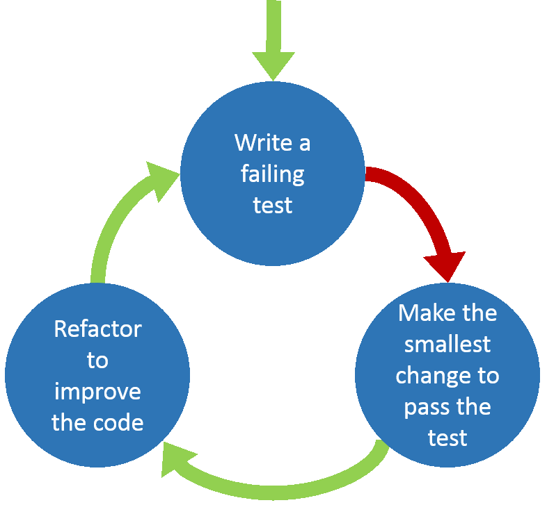

# Testing web applications

### (with a real demo)

  

by *Jordi Pujol*, *Guillermo Guerrero*, and *Adrián Moreno*
 
@ *Tarragona Developers Meetup - 25/01/2017*

---

<!-- .slide: class="two-floating-elements" -->

## The demo app

* Django application
* Based on this book ->
* TODO list

---

### Why testing software is important?

* Gives you confidence
* Fix and prevent bugs
* Provide support for refactoring
* Enables teams to move quicker

----

### Unit tests

* Test the application from the inside
* Small pieces of code, typically individual functions
* Provide input -> validate output
* If test has external dependencies, mock them

----

### Functional tests

* a.k.a Acceptance, End-to-End, Black box, Browser testing
* Test the application from the outside
* Based on a User Story - user interactions
  * e.g.. registering an account, sending a message to a user
* Selenium WebDriver:
  * ChromeDriver, FirefoxDriver, PhantomJSDriver, ...

----

### Functional tests

* Negative scenarios
* Forms
* File manipulation and calculations
* Search
* Media components

----

### Other tests

 

<table>
  <tr>
    <td>- UI and Usability Testing</td>
    <td>- Performance Testing</td>
  </tr>
  <tr>
    <td>- Integration Testing</td>
    <td>- Browser compatibility Testing</td>
  </tr>
  <tr>
    <td>- Security Testing</td>
    <td>- Load Testing</td>
  </tr>
</table>

 

and more...

----

TDD or not TDD?

----

### TDD Cycle

---

## What about code quality?

---

# Thank you

## Questions?

   

[tgndevs.github.io/slides/testing](http://tgndevs.github.io/slides/testing)

